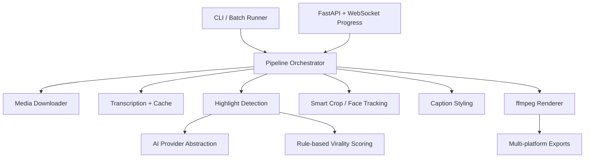

<div align="center">

# Shorts Clipper

### Open-source AI video clipping for YouTube Shorts, TikTok, and Instagram Reels

Turn long-form video into vertical, captioned, high-retention short clips with local transcription, AI-assisted highlight detection, smart rendering foundations, and a modular Python architecture.

[](https://www.python.org/)
[](https://github.com/random-or/shorts-clipper/actions/workflows/ci.yml)
[](LICENSE)
[](#roadmap)

</div>

---

## Why this exists

Shorts Clipper is being built into a production-quality, developer-friendly alternative to closed AI clipping tools such as Opus Clip, Vidyo, and Klap.

The goal is not to hide everything behind a black box. The goal is to give developers a clean, hackable, open-source system for:

- finding the most viral moments in long-form content
- generating platform-ready vertical clips
- adding punchy animated captions
- supporting multiple AI providers
- exposing both CLI and API workflows
- scaling from local experiments to batch production jobs

The repository is currently in an incremental refactor: the original working scripts remain available, while new production modules are being introduced under `shorts_clipper/`.

---

## Highlights

- Local transcription with `faster-whisper`
- AI-assisted highlight selection with Gemini support
- Provider-neutral parsing foundation for future OpenAI, Ollama, and Claude-compatible APIs
- Typed dataclass models for transcripts, clip windows, render presets, jobs, and highlight scores
- Deterministic highlight scoring heuristics for hooks, emotion, retention, virality, silence, speaker emphasis, and caption density
- 9:16 vertical crop/render pipeline
- Safe ffmpeg command builder using argument lists, not shell strings
- `.env`-based settings loader with environment override support
- Unit tests for core logic and rendering command generation
- Docker, docker-compose, GitHub Actions, pre-commit, and contributor docs

---

## Demo workflow

```bash
python pipeline.py "https://www.youtube.com/watch?v=dQw4w9WgXcQ"
```

Current pipeline:


---

## Architecture

The production architecture is being introduced as a modular package:

```text
shorts_clipper/
  core/                 settings, dataclasses, exceptions, logging
  pipeline/             orchestration and resumable jobs
  transcription/        Whisper adapters, transcript cache, formatting
  highlight_detection/  deterministic scoring and candidate ranking
  rendering/            ffmpeg/MoviePy render backends
  captions/             subtitle grouping and style presets
  cropping/             smart crop and face/person framing
  providers/            Gemini/OpenAI/Ollama/Claude-compatible adapters
  api/                  FastAPI backend
  ui/                   CLI and optional dashboard
  utils/                shared utilities
```

Target system design:



---

## Quick start

### 1. Clone

```bash
git clone git@github.com:random-or/shorts-clipper.git
cd shorts-clipper
```

### 2. Create a virtual environment

```bash
python -m venv env
source env/bin/activate
python -m pip install --upgrade pip
pip install -e .
```

### 3. Install system tools

You need `ffmpeg` and `yt-dlp` available on PATH.

Ubuntu/Debian:

```bash
sudo apt-get update
sudo apt-get install -y ffmpeg
```

macOS:

```bash
brew install ffmpeg
```

### 4. Configure environment

```bash
cp .env.example .env
```

Edit `.env` and add your Gemini key:

```env
GEMINI_API_KEY=your-key-here
```

### 5. Run

```bash
python pipeline.py "https://www.youtube.com/watch?v=dQw4w9WgXcQ"
```

The current script writes the finished video to:

```text
final_output.mp4
```

---

## Docker

Build and run locally:

```bash
docker compose build
docker compose run --rm shorts-clipper python pipeline.py "https://www.youtube.com/watch?v=dQw4w9WgXcQ"
```

The compose file mounts local output/cache folders so generated media and downloaded models survive container restarts.

---

## Configuration

Settings can come from real environment variables or `.env`. Real environment variables take priority.

| Variable | Default | Purpose |
| --- | --- | --- |
| `GEMINI_API_KEY` | empty | Gemini API key for current highlight selection |
| `OPENAI_API_KEY` | empty | Reserved for OpenAI-compatible provider support |
| `ANTHROPIC_API_KEY` | empty | Reserved for Claude-compatible provider support |
| `OLLAMA_BASE_URL` | `http://localhost:11434` | Reserved for local Ollama provider support |
| `SHORTS_PROVIDER` | `gemini` | Default AI provider |
| `SHORTS_WHISPER_MODEL` | `tiny.en` | faster-whisper model name |
| `SHORTS_WHISPER_DEVICE` | `cpu` | Whisper device, e.g. `cpu` or `cuda` |
| `SHORTS_WHISPER_COMPUTE_TYPE` | `int8` | Whisper compute type |
| `SHORTS_MODELS_DIR` | `models` | Model cache directory |
| `SHORTS_OUTPUT_DIR` | `outputs` | Future output directory |
| `SHORTS_CACHE_DIR` | `.cache/shorts-clipper` | Future transcript/scene cache |
| `SHORTS_ENABLE_GPU` | `false` | Future GPU acceleration flag |

---

## Development

Run tests:

```bash
python -m unittest discover -v
```

Compile check:

```bash
python -m compileall -q .
```

Install pre-commit hooks:

```bash
pip install pre-commit
pre-commit install
pre-commit run --all-files
```

Current tests cover:

- settings and `.env` loading
- transcript formatting
- AI provider timestamp parsing
- deterministic highlight scoring
- crop geometry
- safe ffmpeg command generation

---

## API roadmap

A FastAPI backend is planned under `shorts_clipper/api` with:

- `POST /jobs` to submit clipping jobs
- `GET /jobs/{job_id}` to inspect status
- `GET /jobs/{job_id}/result` to fetch output metadata
- `WS /jobs/{job_id}/events` for progress updates
- Swagger/OpenAPI docs
- optional lightweight dashboard

See `docs/API.md` for the planned contract.

---

## Output quality roadmap

Planned output features:

- intro hook generation
- auto titles
- viral hashtag generation
- thumbnail frame suggestions
- multi-platform export presets
- subtitle style templates
- animated captions
- emoji emphasis
- face-aware smart crop
- active-speaker auto zoom
- multi-person framing

---

## Roadmap

Detailed roadmap, technical debt, bottlenecks, and implementation phases are documented in:

```text
docs/ROADMAP.md
```

High-level phases:

1. Safe foundations: typed models, settings, logging, tests
2. Modular pipeline: job manifests, isolated work dirs, resume, dry-run, JSON export
3. Performance: ffmpeg single-pass rendering, GPU encoder support, transcript/scene cache
4. AI quality: provider abstraction and multi-candidate virality scoring
5. Video quality: smart crop, face tracking, active speaker zoom, caption presets
6. UX/API/DevOps: polished CLI, FastAPI, WebSocket progress, Docker, CI/CD

---

## Project status

This project is usable as a prototype today and is being actively upgraded into a robust open-source clipping engine.

Expect some compatibility wrappers and legacy scripts to remain while the package internals mature. The guiding principle is:

> Understand first. Improve incrementally. Do not break working behavior.

---

## Contributing

Contributions are welcome. Start with:

- `CONTRIBUTING.md`
- `docs/ROADMAP.md`
- open issues or TODOs in the roadmap

Please keep changes incremental, tested, typed where practical, and beginner-friendly.

---

## Security and responsible use

Only process media you have the right to use. Respect platform terms, creator rights, privacy, and copyright law.

Report security concerns privately using the process in `SECURITY.md`.

---

## License

MIT License. See `LICENSE`.
