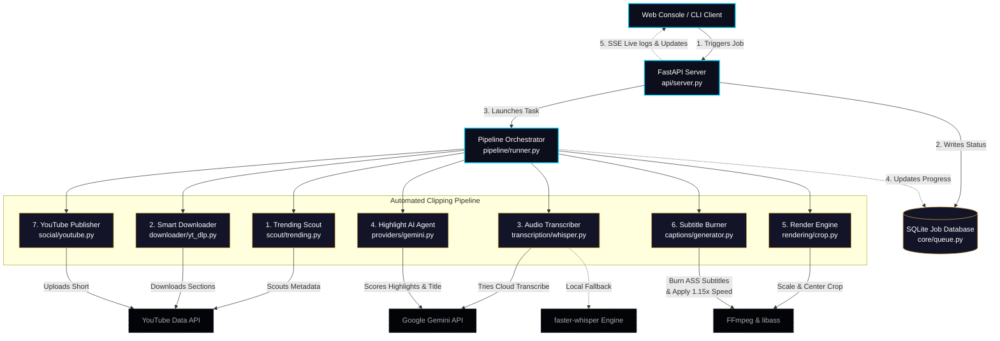

<div align="center">

# 🎬 Shorts Clipper

### **The Enterprise-Grade AI Shorts Factory**

*Scout trending videos → Extract viral highlights → Render vertical crops → Burn animated captions → Auto-publish to YouTube.*

[](https://python.org)
[](LICENSE)
[](#testing)
[](#docker)

</div>

---

## 📖 System Overview & Architecture

Shorts Clipper is a production-ready, AI-driven automation pipeline that scans long-form content (podcasts, streams, talks), isolates the most engaging segments using Gemini, formats them into a vertical `9:16` ratio, burns word-level animated subtitles, and posts them to YouTube Shorts.

Here is the complete picture of how the data flows through the application:



---

## ⚡ Key Pipeline Steps

### 1. 🔍 Trending Scout
The system uses the `trending.py` module to discover high-potential content. It automatically queries YouTube search pools, rotates topic niches (e.g., podcast, AI, tech debates), and scores candidates based on view velocity while filtering out already-processed video IDs.

### 2. 📥 Smart Downloader
Instead of downloading a massive multihour video, `yt_dlp.py` requests **only** the exact timestamp window (e.g., 30s) selected by the AI, saving heavy network bandwidth and disk space.

### 3. 🎙️ Dual-Engine Transcription
First attempts to transcribe via Gemini 2.5 Flash for rapid, cloud-based word-level timestamps. If offline or rate-limited, it falls back to a local `faster-whisper` CTranslate2 engine running on CPU or GPU.

### 4. 🧠 Gemini Highlight Selection
Gemini 2.5 Pro acts as an automated director. It reads the transcription, scores candidate clips based on hook strength, emotional peaks, flow, and self-containment, and outputs titles, tags, and cropping crop layouts (`crop_center`, `crop_left`, or `crop_right`).

### 5. 🎬 Dual-Pass Rendering
* **Pass 1:** Crops the landscape `16:9` video into a clean `1080x1920` vertical canvas.
* **Pass 2:** Transforms word-level transcription into an Advanced SubStation Alpha (`.ass`) subtitle script and burns them into the video using CPU/GPU-accelerated `libass` along with an integrated `1.15x` speed multiplier.

---

## 🖥️ Web Console Features

Launch the dashboard to access three highly polished, dark-mode panels:

| Component | Purpose | Details |
|-----------|---------|---------|
| **Autopilot Launchpad** | Fully Automated Production | Select a niche or channel, choose a schedule, and let the pipeline scout, render, and upload on its own. |
| **Interactive Manual Studio** | Granular Clip Control | Paste any URL, watch the AI detect up to 5 viral highlights, preview segments in-browser, custom crop, and render manually. |
| **Rendered Clip Library** | Asset Management | Browse rendered MP4 files, preview mobile safe-zones, adjust titles, and post to YouTube via OAuth2 with one click. |

---

## 🛠️ Quick Start

### 📋 Prerequisites
* **Python 3.11+**
* **FFmpeg** (configured with `--enable-libass`)
* **Gemini API Key** (Get one from [Google AI Studio](https://aistudio.google.com/))

### ⬇️ Installation

```bash
# 1. Clone the repository
git clone https://github.com/random-or/shorts-clipper.git
cd shorts-clipper

# 2. Set up virtual environment
python -m venv env
source env/bin/activate  # Windows: env\Scripts\activate

# 3. Install packages in editable mode
pip install -e .

# 4. Configure environment settings
cp .env.example .env
```

Open `.env` and fill in your variables (at minimum `GEMINI_API_KEY`).

### 🚀 Running the App

#### **Start the Web Console (FastAPI + Server-Sent Events)**
```bash
python -m shorts_clipper web --port 8000
# Open http://localhost:8000 in your browser
```

#### **Run Pipeline via CLI**
* **Standard Clip Run:**
  ```bash
  python -m shorts_clipper clip "https://youtube.com/watch?v=VIDEO_ID" --count 3
  ```
* **Autopilot Run:**
  ```bash
  python -m shorts_clipper autopilot --niche "tech podcasts" --count 1 --upload
  ```
* **Print Trending Scout Candidates:**
  ```bash
  python -m shorts_clipper scout --niche "finance" --count 5
  ```

---

## 🔑 YouTube Upload Configuration

To authorize direct-to-YouTube publishing:
1. Go to the [Google Cloud Console](https://console.cloud.google.com/).
2. Enable the **YouTube Data API v3**.
3. Create OAuth 2.0 Credentials (select "Desktop app" application type).
4. Download the credentials JSON, rename it to `client_secret.json`, and place it in the root directory of this project.
5. Launch the Web UI, click the sidebar avatar, and connect your channel.

---

## 🐳 Docker Deployment

Run the entire application in a container (includes automated FFmpeg setup):

```bash
# Build
docker build -t shorts-clipper .

# Run
docker run -p 8000:8000 --env-file .env shorts-clipper
```

---

## 🧪 Testing and Linting

Verify and test changes before pushing to git:

```bash
# Install development dependencies
pip install -e ".[dev]"

# Run tests
pytest

# Code style and checks
ruff check shorts_clipper
```
