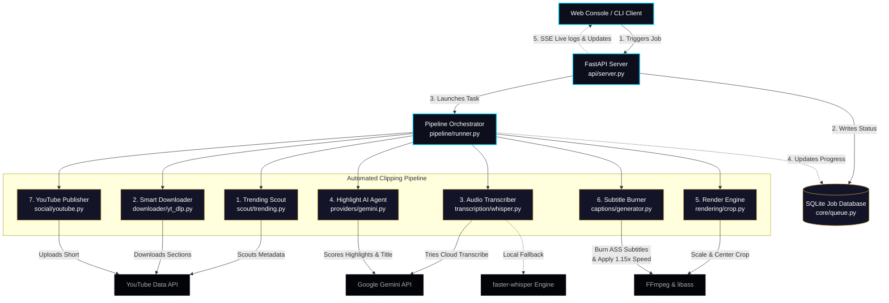

<div align="center">

# 🎬 Shorts Clipper

### **The Enterprise-Grade AI Shorts Factory**

*Scout trending videos → Extract viral highlights → Render vertical crops → Burn animated captions → Auto-publish to YouTube.*

[](https://python.org)
[](LICENSE)
[](#testing)
[](#docker)

</div>

---

## 📖 System Overview & Architecture

Shorts Clipper is a production-grade, AI-driven automation pipeline that transforms standard 16:9 landscape videos (podcasts, webinars, gaming streams) into high-retention 9:16 vertical shorts with word-level animated subtitles, ready for multi-platform distribution.

Here is the system architecture showing how components interact:



---

## ⚡ Key Pipeline Steps

### 1. 🔍 Trending Scout
Scans selected channels, search terms, or broader topic niches (e.g., podcast, AI debates). Candidates are scored using engagement metrics (view velocity) while maintaining a local SQLite-backed cache to prevent duplicate processing of the same content within 7 days.

### 2. 📥 Smart Downloader
Uses `yt-dlp`'s `--download-sections` flag to download **only** the designated segment. This isolates audio and video streams without downloading full multi-hour episodes, saving bandwidth and disk write operations.

### 3. 🎙️ Dual-Engine Transcription
Primary transcription runs via the Gemini 2.5 Flash API for high-speed cloud generation of word-level timestamped transcripts. If credentials are missing or the API is rate-limited, it automatically falls back to a local `faster-whisper` CTranslate2 model running on CPU/GPU.

### 4. 🧠 Gemini Highlight Selection
Gemini 2.5 Pro acts as an automated editor, reading the timestamps and scoring candidates across five viral dimensions: **Hook Strength**, **Emotional Peak**, **Dialogue Flow**, **Information Density**, and **Self-Containment**. It returns the exact start/end range, layout recommendation (`crop_center`, `crop_left`, or `crop_right`), and recommended titles and description.

### 5. 🎬 Dual-Pass Rendering
* **Pass 1:** Crops and scales the source video into a `1080x1920` vertical aspect ratio.
* **Pass 2:** Builds an Advanced SubStation Alpha (`.ass`) subtitle script from word-level timestamps and burns it into the video using FFmpeg's GPU/CPU accelerated `libass` library. Crucially, it applies a **1.15× speedup** in this single encoding pass, preventing multiple transcoding iterations.

---

## 🖥️ Web Console Features

Start the dashboard to access three highly polished, dark-mode panels:

| Component | Purpose | Details |
|-----------|---------|---------|
| **Autopilot Launchpad** | Fully Automated Production | Define a niche, select a duration (today/week/month), and let the watchdog scout, download, crop, style, and post. |
| **Interactive Manual Studio** | Granular Clip Control | Paste any URL, inspect AI highlight scores, preview clips in-browser with mock phone frames, and edit before rendering. |
| **Rendered Clip Library** | Asset Library Management | Browse rendered MP4 files, preview safe-zones, adjust titles, and post to YouTube via OAuth2 with one click. |

---

## 🛠️ Quick Start

### 📋 Prerequisites
* **Python 3.11+**
* **FFmpeg** (must be compiled with `--enable-libass` support)
* **Gemini API Key** (available at [Google AI Studio](https://aistudio.google.com/))

### ⬇️ Installation

```bash
# 1. Clone the repository
git clone https://github.com/random-or/shorts-clipper.git
cd shorts-clipper

# 2. Set up virtual environment
python -m venv env
source env/bin/activate  # Windows: env\Scripts\activate

# 3. Install packages in editable mode
pip install -e .

# 4. Configure environment settings
cp .env.example .env
```

Open the newly created `.env` file and fill in your variables (at minimum `GEMINI_API_KEY`).

### 🚀 Running the Application

#### **1. Launch the Web Console**
```bash
python -m shorts_clipper web --port 8000
# Open http://localhost:8000 in your web browser
```

#### **2. Run via CLI**
* **Clip a Specific Video:**
  ```bash
  python -m shorts_clipper clip "https://youtube.com/watch?v=VIDEO_ID" --count 3
  ```
* **Run in Autopilot Mode:**
  ```bash
  python -m shorts_clipper autopilot --niche "tech news" --count 2 --upload
  ```
* **Scout Trending Videos Only:**
  ```bash
  python -m shorts_clipper scout --niche "finance" --count 5
  ```

---

## ⚙️ Configuration Reference (`.env`)

All parameters are configured in the `.env` file:

| Variable | Default Value | Description |
|----------|---------------|-------------|
| `GEMINI_API_KEY` | *(None)* | **Required.** Your Google Gemini API key. |
| `SHORTS_WHISPER_MODEL` | `tiny.en` | Local transcription model size (`tiny.en` up to `large-v3`). |
| `SHORTS_WHISPER_DEVICE` | `cpu` | Device for local Whisper running (`cpu` or `cuda`). |
| `SHORTS_VIDEO_CODEC` | `libx264` | Video encoder encoder: standard `libx264` or NVIDIA GPU accelerated `h264_nvenc`. |
| `SHORTS_ENABLE_GPU` | `false` | Enable hardware acceleration toggles for both Whisper and FFmpeg. |
| `SHORTS_OUTPUT_DIR` | `./outputs` | Folder where generated vertical MP4 clips are stored. |

---

## 🔑 YouTube Upload Configuration

To authorize direct-to-YouTube publishing:
1. Go to the [Google Cloud Console](https://console.cloud.google.com/).
2. Enable the **YouTube Data API v3** in your project.
3. Create OAuth 2.0 Credentials (select "Desktop app" as application type).
4. Download the credentials JSON, rename it to `client_secret.json`, and place it in the root folder of this project.
5. Launch the Web UI, click the sidebar avatar, and connect your channel.

---

## 🐳 Docker Deployment

Run the entire application containerized (fully pre-configured with Python, FFmpeg, and `libass` libraries):

```bash
# Build
docker build -t shorts-clipper .

# Run
docker run -p 8000:8000 --env-file .env shorts-clipper
```

---

## 🖥️ Production Daemonizing (systemd setup)

To keep the FastAPI server running persistently in a production Linux environment:

Create `/etc/systemd/system/shorts-clipper.service`:
```ini
[Unit]
Description=Shorts Clipper Web Console Service
After=network.target

[Service]
User=random
WorkingDirectory=/home/random/shorts-clipper
ExecStart=/home/random/shorts-clipper/env/bin/python -m shorts_clipper web --host 0.0.0.0 --port 8000
Restart=always
RestartSec=5
EnvironmentFile=/home/random/shorts-clipper/.env

[Install]
WantedBy=multi-user.target
```

Enable and start:
```bash
sudo systemctl daemon-reload
sudo systemctl enable shorts-clipper.service
sudo systemctl start shorts-clipper.service
```

---

## ❓ Troubleshooting & FAQ

### **Q: FFmpeg crashes with `No such filter: 'ass'`**
* **Cause:** Your system FFmpeg binary was not compiled with `libass` subtitle renderer support.
* **Solution:**
  * **Ubuntu/Debian:** `sudo apt-get update && sudo apt-get install ffmpeg`
  * **macOS (Homebrew):** `brew install ffmpeg`
  * **Windows:** Download a full shared build containing extra filters from [gyan.dev](https://www.gyan.dev/ffmpeg/builds/).

### **Q: Subtitles burn successfully but text characters are missing/blank**
* **Cause:** The host environment lacks basic Arial/Montserrat fonts referenced in the caption styler.
* **Solution:**
  * **Ubuntu/Debian:** 
    ```bash
    sudo apt-get install ttf-mscorefonts-installer fontconfig
    sudo fc-cache -fv
    ```

### **Q: Local Whisper execution runs out of memory (OOM)**
* **Cause:** Running larger Whisper models (like `small` or `large-v3`) on CPU or systems with low VRAM.
* **Solution:** Set `SHORTS_WHISPER_MODEL=tiny.en` in `.env` for standard CPU execution, or enable GPU configurations (`SHORTS_WHISPER_DEVICE=cuda`, `SHORTS_ENABLE_GPU=true`).

### **Q: Gemini returns HTTP 429 (Too Many Requests)**
* **Cause:** The free-tier Gemini API key allows up to 15 requests per minute.
* **Solution:** Space out manual video searches or register a pay-as-you-go billing profile on Google AI Studio to increase rate limits.

---

## 🧪 Testing and Linting

Verify formatting and test suites pass before pushing updates:

```bash
# Install development dependencies
pip install -e ".[dev]"

# Run tests
pytest

# Code style checks
ruff check shorts_clipper
```
