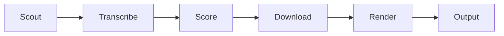

# Shorts Clipper ✂️

> AI-powered pipeline that scouts YouTube for viral moments and renders them as 9:16 Shorts — fully automated.


## What it does
Shorts Clipper completely automates the extraction of viral short-form content from long-form YouTube videos. It handles the entire lifecycle: discovering trending videos based on niche keywords, downloading audio, generating precision word-level transcripts, and using AI to isolate high-retention moments. Finally, it uses FFmpeg to crop the segment to a 9:16 vertical format and burns in dynamic, animated ASS subtitles without requiring manual video editing.

---

## How it works



- **Scout:** Uses the YouTube Data API and yt-dlp to discover trending videos within specific niches while respecting age and view thresholds.
- **Transcribe:** Fetches native English subtitles or falls back to a fast local Whisper transcription (with Gemini Flash acceleration) to generate precise word-level timings.
- **Score:** Evaluates the transcript using Gemini Pro as an Attention Prediction Engine to locate the most emotionally intense, high-retention highlight windows.
- **Download:** Employs yt-dlp to extract only the required video segment, saving bandwidth and processing time.
- **Render:** Scales, crops to 1080x1920, and burns in custom, animated `.ass` subtitles in a single GPU-accelerated FFmpeg pass.
- **Output:** Generates a ready-to-publish MP4 along with metadata (title, description, tags) and can automatically upload it to YouTube Shorts.

---

## Tech Stack
- Python + FastAPI
- yt-dlp
- Whisper (local) + subtitle fallback
- Google Gemini (free tier, 20 req/day limit)
- FFmpeg
- YouTube Data API v3
- Webshare proxy

---

## Prerequisites
- Python 3.11+
- `ffmpeg` installed and on your PATH
- `yt-dlp` installed
- API keys: `GEMINI_API_KEY` (required), `YOUTUBE_API_KEY` (optional but recommended), Webshare proxy (optional)

---

## Quick Start

```bash
git clone https://github.com/random-or/shorts-clipper.git
cd shorts-clipper
pip install -r requirements.txt
cp .env.example .env
# edit .env and add your GEMINI_API_KEY
python -m shorts_clipper autopilot --niche "tech"
```

---

## Configuration

| Variable | Required | Description |
|---|---|---|
| `GEMINI_API_KEY` | **Yes** | Google Gemini API key used for AI highlight scoring and metadata generation. |
| `YOUTUBE_API_KEY` | No | YouTube Data API v3 key for faster, reliable video discovery (10,000 quota/day). |
| `SHORTS_PROXY` | No | Proxy string (e.g., Webshare credentials) to bypass YouTube scraping blocks. |
| `SHORTS_WHISPER_MODEL` | No | Whisper model size for transcription fallback (default: `tiny.en`). |
| `SHORTS_WHISPER_DEVICE` | No | Device to run Whisper on: `cpu` or `cuda` (default: `cpu`). |
| `SHORTS_WHISPER_COMPUTE_TYPE` | No | Compute type for Whisper: `int8` or `float16` (default: `int8`). |
| `SHORTS_VIDEO_CODEC` | No | FFmpeg video codec for rendering (default: `libx264` or `h264_nvenc`). |
| `SHORTS_VIDEO_PRESET` | No | FFmpeg encoding preset (default: `ultrafast`). |
| `SHORTS_SCOUT_MAX_AGE_DAYS`| No | Maximum age of trending videos to scout (default: `90`). |
| `SHORTS_ENABLE_GPU` | No | Set to `true` to enable CUDA Whisper and NVENC hardware encoding. |
| `SHORTS_OUTPUT_DIR` | No | Directory to store generated clips and metadata (default: `outputs`). |
| `SHORTS_LOG_LEVEL` | No | Application logging level (default: `INFO`). |

---

## Project Structure

```text
shorts-clipper/
├── pipeline.py                       # Root wrapper for backward compatibility
├── shorts_clipper/
│   ├── __main__.py                   # CLI entry point for scout, clip, and autopilot commands
│   ├── analyze/
│   │   └── feedback.py               # Evaluates performance metrics of generated clips
│   ├── api/
│   │   └── server.py                 # FastAPI web console and background job server
│   ├── captions/
│   │   └── generator.py              # Generates animated ASS subtitle files for FFmpeg
│   ├── cli/
│   │   └── repair_metadata.py        # CLI tool to fix missing metadata in existing clips
│   ├── core/
│   │   ├── cache.py                  # SQLite-based caching for API responses
│   │   ├── exceptions.py             # Custom exceptions (e.g., Rate Limits, Missing Subs)
│   │   ├── logging.py                # Console and file logger configuration
│   │   ├── models.py                 # Dataclasses for transcripts, highlight scores, and jobs
│   │   ├── queue.py                  # SQLite-backed background job queue management
│   │   ├── settings.py               # Environment variables and configuration loader
│   │   └── worker.py                 # Background worker process for asynchronous jobs
│   ├── cropping/
│   │   └── geometry.py               # Calculates dimensions for center and edge crops
│   ├── downloader/
│   │   └── yt_dlp.py                 # Fetches video, audio, and YouTube subtitles safely
│   ├── highlight_detection/
│   │   └── scoring.py                # Deterministic scoring heuristics for backup evaluation
│   ├── metadata/
│   │   └── fallback.py               # Local metadata generation when AI APIs are unavailable
│   ├── pipeline/
│   │   └── runner.py                 # Main orchestration flow from scout to final render
│   ├── providers/
│   │   ├── base.py                   # Abstract base class for AI prompt providers
│   │   └── gemini.py                 # Gemini implementation for Attention Prediction scoring
│   ├── publish/
│   │   └── *                         # Future multi-platform publish modules
│   ├── render/
│   │   └── thumbnailer.py            # Extracts frame thumbnails for generated clips
│   ├── rendering/
│   │   ├── crop.py                   # FFmpeg video cropping and 9:16 vertical scaling
│   │   ├── ffmpeg.py                 # Safe FFmpeg subprocess command builders
│   │   └── pipe.py                   # Handles streaming I/O for media processing
│   ├── scout/
│   │   ├── keywords.py               # Niche-to-keyword mapping and dynamic AI expansion
│   │   ├── memory.py                 # SQLite storage for successful channel tracking
│   │   ├── metrics.py                # Tracks scout performance and API quota usage
│   │   ├── relevance.py              # Semantic filtering for candidate videos
│   │   ├── subtitle_cache.py         # Subtitle availability caching to avoid 429s
│   │   ├── trending.py               # Multi-stage parallel video discovery and ranking
│   │   └── youtube_api.py            # Official YouTube Data API v3 client implementation
│   ├── social/
│   │   └── youtube.py                # YouTube OAuth authentication and Shorts upload logic
│   ├── transcription/
│   │   ├── formatting.py             # Formats transcript segments for AI context
│   │   └── whisper.py                # Faster-whisper local transcription logic
│   └── utils/
│       └── video.py                  # Helper functions for FFprobe media probing
```

---

## Known Limitations / Current Status

- YouTube bot detection frequently blocks the pipeline on cloud platforms (Railway, Oracle, HuggingFace, Colab) — works best on residential IPs.
- Gemini free tier enforces a 20 request/day quota — large batches will quickly hit this limit and fall back to local heuristics.
- Scout V2 runtime typically takes 30–60 minutes per run depending on the batch size and subtitle fetch speed.
- For reliable automated scraping, it is highly recommended to run locally or configure a residential proxy.

---

## Deployment

- **Local:** Just run `python -m shorts_clipper autopilot` to execute locally.
- **Railway:** Environment variables go in the Railway dashboard; pushing to the `main` branch triggers an automatic deploy.
- **Proxy:** Set Webshare credentials in `SHORTS_PROXY` environment variable for reliable cloud execution.

---

## Contributing

Open issues and PRs are always welcome. Please describe your fix or feature clearly in the pull request description.

---

## License

MIT
