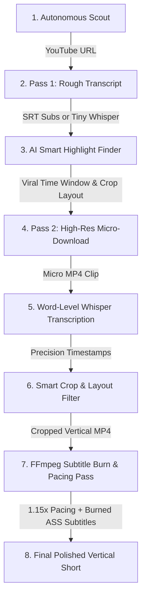

<div align="center">

# 🎬 Shorts Clipper
**The Ultimate Autonomous AI Video Factory**

[](https://www.python.org/)
[](LICENSE)
[](https://github.com/astral-sh/ruff)
[](#)

*Transform long-form landscape YouTube content into highly-engaging, viral vertical clips—completely autonomously with Gemini & local Whisper.*

</div>

---

## 🎯 The Final Goal (What the Project Achieves)

Manually finding, cutting, cropping, and captioning video content for modern short-form feeds (TikTok, YouTube Shorts, Instagram Reels) is highly tedious, repetitive, and unscalable.

**Shorts Clipper** is an industrial-grade, AI-driven automation pipeline that handles the entire lifecycle of viral clip creation. The system takes a landscape video (16:9) and outputs a production-ready, vertical (9:16) MP4 video with:
1. **AI-Driven Smart Hook Detection**: A reasoning-based LLM evaluates video transcripts to identify the single best high-engagement 30-to-60-second segment containing strong hooks in the first 2 seconds, high emotional tension, and independent narrative coherence.
2. **Dynamic Aspect Ratio Conversion**: Intelligent conversion of landscape footage into 9:16 vertical formats, supporting center-crop, smart left/right crops, and dual-subject split-screen formats (perfect for podcast exchanges and interviews).
3. **Dual-Color Animated Subtitles**: Highly stylized, modern, burned-in Advanced SubStation Alpha (`.ass`) captions rendered at word-level timing precision.
4. **Pacing Optimization**: A native FFmpeg filter speed-up (1.15× pacing) seamlessly merged into the subtitle rendering step, removing dead air without introducing audio pitch distortions or requiring triple-encoding.

---

## 🏗️ System Architecture & Data Flow

Shorts Clipper relies on a clean, modular Domain-Driven Design (DDD) backend:



### The 2-Pass Performance Advantage
To maximize execution speed and minimize local network bandwidth:
* **Pass 1 (Selection)**: The pipeline fetches only native subtitles (or downloads a low-bandwidth 5-minute audio sample) to run a fast transcript analysis. The LLM evaluates this transcript to choose the exact timestamps of the best clip window.
* **Pass 2 (Extraction)**: Only the selected micro-clip (typically 30–60s) is downloaded in high resolution. This is followed by high-accuracy, word-level Whisper transcription and FFmpeg cropping. This architecture saves gigabytes of network bandwidth and cuts rendering time per video by up to 90%.

---

## 🛠️ System Prerequisites

Your system must have the following system-level dependencies installed:

1. **Python 3.11+**
2. **FFmpeg**: Must be compiled with **`libass` support** to enable advanced subtitle burning.
   * **Ubuntu/Debian**:
     ```bash
     sudo apt update && sudo apt install ffmpeg libass-dev -y
     ```
   * **macOS**:
     ```bash
     brew install ffmpeg
     ```
   * **Windows**: Download a full static build from [Gyan.dev](https://www.gyan.dev/ffmpeg/builds/) or install via package manager:
     ```powershell
     winget install Gyan.FFmpeg
     ```
3. **yt-dlp**: Handled automatically as a Python dependency, but having the system-level binary is highly recommended for high-speed downloads.

---

## 📥 Step-by-Step Installation

Follow these exact steps to configure your environment:

### 1. Clone the Repository
```bash
git clone https://github.com/random-or/shorts-clipper.git
cd shorts-clipper
```

### 2. Create and Activate a Virtual Environment
```bash
# Create environment
python -m venv env

# Activate environment (Linux/macOS)
source env/bin/activate

# Activate environment (Windows Command Prompt)
env\Scripts\activate.bat

# Activate environment (Windows PowerShell)
.\env\Scripts\Activate.ps1
```

### 3. Install Python Dependencies
```bash
# Standard runtime installation
pip install -r requirements.txt
pip install -e .

# OR install with development dependencies (for pytest and linting)
pip install -e ".[dev]"
```

---

## 🔑 AI Provider Setup & API Configuration

### Why an API Key is Required
To isolate high-virality highlights and select the optimal cropping layout (e.g., center crop vs. split-screen podcast format), the pipeline integrates with an LLM. By default, it uses **Google Gemini 2.5 Flash** for its exceptional reasoning, fast speeds, and large context windows, accessed through the official `google-genai` SDK.

### Step-by-Step API Key Setup
1. Duplicate the template environment file:
   ```bash
   cp .env.example .env
   ```
2. Open the newly created `.env` file in your preferred text editor.
3. Obtain a free API key from [Google AI Studio](https://aistudio.google.com/).
4. Insert your key next to `GEMINI_API_KEY` in the `.env` file:
   ```env
   # AI providers
   GEMINI_API_KEY=AIzaSyYourActualGeminiApiKeyHere
   SHORTS_PROVIDER=gemini
   ```

Now, the pipeline is fully authorized to consult Gemini during highlight selection!

---

## 💻 How to Run the Pipeline (Usage)

Shorts Clipper provides a simple command-line interface under the `python -m shorts_clipper` command (or the installed binary alias `shorts-clipper`).

### 1. Targeted Mode (Clip a Specific Video)
Provide a direct YouTube link to clip the single best viral segment from that specific video:
```bash
python -m shorts_clipper clip "https://www.youtube.com/watch?v=VIDEO_ID"
```

To output the file to a specific directory or custom filename, use the `-o` or `--output` flag:
```bash
python -m shorts_clipper clip "https://www.youtube.com/watch?v=VIDEO_ID" -o "./clips/my_viral_short.mp4"
```

### 2. Autonomous Mode (Autopilot)
Let the system scout high-virality trending videos (drama, debate, podcast, or motivational niches), score them using view velocity algorithms, choose the best candidate, select the hook, crop it, and write the output—completely unattended:
```bash
python -m shorts_clipper autopilot
```

### 3. Scout Mode (Dry Run)
Query the trending pools, score them, and print the URLs of the best candidate videos without clipping or rendering:
```bash
python -m shorts_clipper scout -n 3
```

---

## ⚙️ Advanced Configuration (`.env` Settings)

Modify these settings in your `.env` file to customize the pipeline's behavior:

| Variable | Default Value | Description |
| :--- | :--- | :--- |
| `GEMINI_API_KEY` | *(Empty)* | Your Google Gemini API Key. |
| `SHORTS_PROVIDER` | `gemini` | The active LLM engine provider (`gemini`). |
| `SHORTS_WHISPER_MODEL` | `tiny.en` | Local Whisper transcription model (choices: `tiny.en`, `base.en`, `small.en`, `medium.en`, `large-v3`). |
| `SHORTS_WHISPER_DEVICE` | `cpu` | Hardware device for Whisper inference (`cpu` or `cuda` for NVIDIA GPU acceleration). |
| `SHORTS_WHISPER_COMPUTE_TYPE` | `int8` | Quantization type for Whisper (`int8` for fast CPU execution, `float16` for CUDA GPUs). |
| `SHORTS_ENABLE_GPU` | `false` | Set to `true` to activate GPU hardware acceleration for both Whisper and FFmpeg. |
| `SHORTS_MODELS_DIR` | `models` | Directory where local Whisper weights are stored. |
| `SHORTS_OUTPUT_DIR` | `outputs` | Target directory where completed 9:16 vertical clips are saved. |
| `SHORTS_CACHE_DIR` | `.cache/shorts-clipper` | Directory for storing scout history cache (to prevent duplicate clip generation). |
| `SHORTS_LOG_LEVEL` | `INFO` | Terminal log verbosity level (`DEBUG`, `INFO`, `WARNING`, `ERROR`). |

---

## 🧪 Testing & Code Quality

Shorts Clipper maintains a high-coverage unit-test suite checking settings parsing, crop geometry calculation, ASS subtitle formatting, and yt-dlp section generation logic.

Run the test suite using Python's native test runner:
```bash
python -m unittest discover -s tests -p "test_*.py"
```

Verify style guidelines and formatting using Ruff:
```bash
ruff check .
ruff format --check .
```

---

## 🛡️ License

Distributed under the **MIT License**. See the [LICENSE](LICENSE) file for more information.
