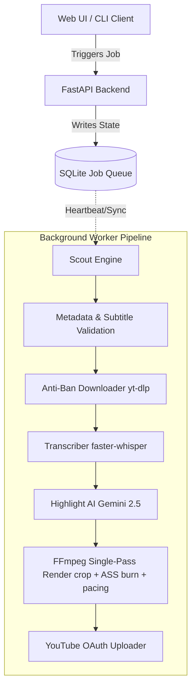

# Shorts Clipper

## Overview
AI-powered video clipping pipeline that automatically extracts, processes, subtitles, and prepares short-form content for TikTok, Reels, and YouTube Shorts. 

Content creators and media agencies face a massive time sink when attempting to repurpose long-form videos (podcasts, streams, webinars) into highly engaging vertical short-form content. Manual editing requires hours of scrubbing, transcription, layout reframing, and subtitle synchronization.

**Shorts Clipper** solves this by fully automating the pipeline. It intelligently scouts trending topics, securely bypasses bot detection to ingest the raw footage, utilizes Gemini AI to locate emotionally resonant hooks, and leverages FFmpeg to reframe and burn stylized subtitles in a highly optimized single-pass render.

It is built for developers, agencies, and creators who need a scalable, API-first, self-healing pipeline capable of running completely on autopilot.

## Features
* **AI-powered trending video discovery**: Auto-discovers viral videos based on targeted niches with a self-healing parallel scout engine.
* **YouTube Data API integration**: Employs rapid discovery over the official YouTube v3 API, safely falling back to advanced scraper methods on quotas.
* **Intelligent virality scoring**: Ranks candidates in real-time based on views, likes, comments velocity, and recency.
* **Automatic subtitle detection**: Validates candidate video subtitle existence and formats proactively before ingestion.
* **Multi-stage filtering pipeline**: Rigorously weeds out invalid videos using customizable thresholds (duration, minimum views, age).
* **Whisper fallback transcription**: Employs `faster-whisper` for offline precision transcription with selectable models (`tiny.en` to `large-v3`) and hardware acceleration support.
* **Learning system**: Adapts topic and query discoveries dynamically.
* **Web UI**: Offers a complete dashboard to trigger and manage background tasks.
* **Automated shorts generation**: Renders the 9:16 vertical crop, applies pacing, and burns word-level `.ass` animated subtitles all within a single FFmpeg execution.

## Architecture



## Installation

**Linux Setup Instructions**
1. Clone the repository:
   ```bash
   git clone https://github.com/random-or/shorts-clipper.git
   cd shorts-clipper
   ```
2. Create and activate a virtual environment:
   ```bash
   python3 -m venv env
   source env/bin/activate
   ```
3. Install the dependencies:
   ```bash
   pip install -r requirements.txt
   ```
4. Install system dependencies (ffmpeg is required for rendering):
   ```bash
   sudo apt-get update && sudo apt-get install ffmpeg
   ```

## Configuration

Copy `.env.example` to `.env` and fill in the required variables:

```bash
cp .env.example .env
```

**Required API Keys:**
* `YOUTUBE_API_KEY`: Required for fast trending topic discovery and quota optimization. Get this from the Google Cloud Console.
* `GEMINI_API_KEY`: Required for intelligent highlighting. Retrieves emotional peaks from transcripts.
* `OPENAI_API_KEY`: (Optional) Can be used if switching the highlighting provider to OpenAI.

**Additional Settings (Optional):**
* `SHORTS_WHISPER_MODEL`: Default is `tiny.en`. Change to `base.en` or `small.en` for more accuracy.
* `SHORTS_SCOUT_MAX_AGE_DAYS`: Default is `90`. Sets the window for trending video discovery.
* `SHORTS_ENABLE_GPU`: Set to `true` to enable hardware acceleration for Whisper transcription and FFmpeg.

## Usage

**Start the Web UI & Background Worker:**
```bash
python -m shorts_clipper web
```
This spawns the FastAPI server on `http://127.0.0.1:8000` and automatically starts a background worker. From the Web UI, you can seamlessly fire off "Autopilot" scouts or manage your queue.

**Start the CLI Worker manually (if running separated):**
```bash
python -m shorts_clipper worker
```

**Trigger an Autopilot job programmatically:**
```bash
curl -X POST http://127.0.0.1:8000/api/autopilot \
     -H "Content-Type: application/json" \
     -d '{"niche": "tech", "count": 1, "scout_duration": "month"}'
```

## How Scout Works

The Scout engine runs on autopilot to find the best videos autonomously:

1. **Discovery:** Generates dynamic search queries based on the niche (e.g., "tech") and fetches candidates rapidly using the YouTube Data API.
2. **Filtering:** Rejects videos that are too long, too short, too old, or have insufficient views.
3. **Scoring:** Ranks surviving videos using a sophisticated virality metric that weighs view velocity, engagement (likes/comments), and recency.
4. **Validation:** Sequentially verifies candidates for the existence of English subtitles, eliminating videos that require costly offline transcriptions unnecessarily.
5. **Winner Selection:** Selects the highest-scored valid video, updates the internal memory to adapt future searches, and forwards the video to the clipping pipeline.

## Performance Improvements

Recent system upgrades ensure production reliability and unmatched speed:

* **API discovery path:** Replaced slow `--dump-json` queries with lightning-fast YouTube Data API requests. Discovery time dropped from ~45 seconds to near-zero.
* **Queue fixes:** Patched global initialization artifacts in the persistent SQLite queue. Eliminates erroneous startup-failure conditions for jobs pending in highly concurrent setups.
* **Heartbeat fixes:** Engineered persistent heartbeats during highly-intensive offline processing blocks (Whisper/FFmpeg). Eliminates "dead worker" misidentifications and phantom restarts.
* **Caption API optimization:** Directly interrogates YouTube API captions endpoint instead of falling back to payload dumps, radically shifting subtitle validation times to microseconds.

## Troubleshooting

* **Interrupted by server restart error:** This typically happens if the worker process is explicitly killed without draining the queue. Ensure you use graceful shutdowns (`SIGTERM`) or rely on the self-healing worker heartbeat to cleanly resume.
* **yt-dlp rate limits (429 errors):** If yt-dlp starts timing out, try rotating your `SHORTS_PROXY` environment variable or confirm `curl-cffi` is actively impersonating browser TLS fingerprints.
* **FFmpeg missing codec errors:** If you enabled `SHORTS_ENABLE_GPU=true`, verify that you have `h264_nvenc` available in your system's FFmpeg build. If not, revert to `libx264`.

## Roadmap

* Add multi-platform publisher integration (TikTok, Instagram Reels).
* Implement Ken Burns effect auto-zoom & pan.
* Enhanced B-Roll generation using external APIs.

## License

MIT License. See `LICENSE` for more information.
