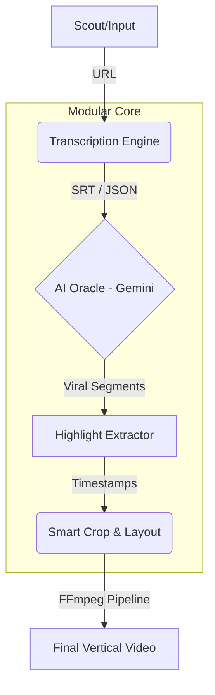

<div align="center">
  
# 🎬 Shorts Clipper
**The Autonomous AI Video Factory**

[](https://www.python.org/)
[](LICENSE)
[](#)

*Transform long-form YouTube content into highly-engaging, viral vertical clips—completely autonomously.*

</div>

---

## 🚀 The Vision: Why Shorts Clipper?

The creator economy demands high-volume, high-retention content. However, manually scrubbing through hours of podcasts or streams to find the perfect 45-second hook is tedious and unscalable. 

**Shorts Clipper** is designed to solve this. It is a professional-grade, AI-driven automation pipeline that handles the entire lifecycle of clip creation: from scouting trending videos, to analyzing transcripts with LLMs for viral hooks, down to the final rendering of a polished 9:16 vertical video.

Whether you're a creator looking to scale your reach on TikTok, YouTube Shorts, and Instagram Reels, or a developer interested in building fully autonomous content agents, Shorts Clipper provides the modular foundation you need.

---

## ✨ Core Capabilities

- 🤖 **Autonomous Content Scouting**: Automatically hunts for high-signal, trending YouTube videos, avoiding duplicates and noise.
- 🧠 **AI-Powered Hook Detection**: Utilizes **Gemini 2.5 Flash** to semantically analyze transcripts, scoring and extracting segments that guarantee high audience retention.
- 🎙️ **Hybrid Transcription Engine**: 
  - Prefers high-quality native YouTube subtitles for lightning-fast processing.
  - Seamlessly falls back to local `faster-whisper` for precise, word-level timestamps when native subs aren't available.
- 📐 **Dynamic Smart Cropping**: Intelligently frames subjects using adaptive layouts:
  - `crop_center`, `crop_left`, `crop_right`
  - `split_screen` (Perfect for podcasts and reaction videos)
- ⚡ **Production-Ready Rendering**: Built on highly optimized `ffmpeg` and `MoviePy` pipelines. Each job runs in isolated workspaces to ensure clean batch processing.

---

## 🏗️ System Architecture

The architecture follows a robust, Domain-Driven Design (DDD) to ensure scalability from a CLI tool to a massive cloud-native backend.



---

## 🛠️ Quick Start Guide

### 1. Prerequisites

Ensure your system has the following installed:
- **Python 3.11+**
- **FFmpeg** (must be compiled with `libass` support for subtitles)
- **yt-dlp** (for high-speed video/audio acquisition)

### 2. Installation

Clone the repository and set up your virtual environment:

```bash
git clone https://github.com/random-or/shorts-clipper.git
cd shorts-clipper

# Create and activate a virtual environment
python -m venv env
source env/bin/activate  # On Windows use `env\Scripts\activate`

# Install the package and dependencies
pip install -e .
```

### 3. Configuration

Shorts Clipper relies on AI for its hook generation. You need to configure your environment variables:

```bash
cp .env.example .env
```
Edit the `.env` file and insert your `GEMINI_API_KEY`.

### 4. Running the Factory

You can run Shorts Clipper in two powerful modes:

**Targeted Mode (Single Video):**
```bash
python pipeline.py "https://www.youtube.com/watch?v=YOUR_VIDEO_ID"
```

**Autonomous Mode (Scout & Clip):**
Let the system find trending content and process it automatically.
```bash
python pipeline.py
```

The resulting viral clips are saved automatically in the `outputs/` directory.

---

## 🗺️ Roadmap & Huge Potential

Shorts Clipper is evolving from a powerful CLI into a **full-stack autonomous AI agent**. Our roadmap includes:

- **Phase 1 (Current):** Rock-solid CLI pipeline, advanced transcript analysis, and basic layout rendering.
- **Phase 2:** Integration of B-Roll, automated dynamic captions (Alex Hormozi style), and face-tracking algorithms.
- **Phase 3:** Full FastAPI backend backend, allowing for cloud deployment, parallel distributed processing, and a Next.js web dashboard.
- **Phase 4:** Direct social media integration for 100% hands-free publishing.

For a detailed breakdown of our technical trajectory, check out the [AUDIT_ROADMAP.md](AUDIT_ROADMAP.md).

---

## 🤝 Contributing

We welcome contributions from developers, AI enthusiasts, and creators! Whether you're optimizing ffmpeg commands, improving the Gemini prompts, or building out the upcoming API, your help is valued.

Please see our [CONTRIBUTING.md](CONTRIBUTING.md) for guidelines on how to get started.

- **Run tests:** `python -m unittest discover -v`
- **Linting:** `pre-commit run --all-files`

---

## 🛡️ License & Security

This project is open-sourced under the **MIT License**. See the [LICENSE](LICENSE) file for details.
For security policies, please review [SECURITY.md](SECURITY.md).

<div align="center">
  <i>Empowering creators to scale through AI. Let's build the future of content automation together.</i>
</div>
