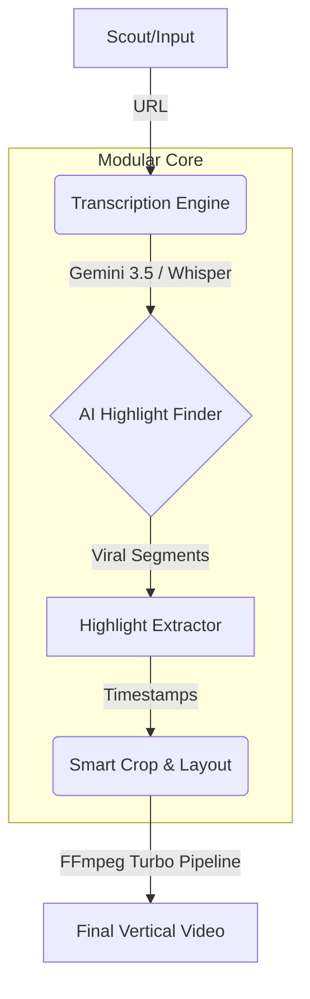

<div align="center">

# 🎬 Shorts Clipper
**The Ultimate Autonomous AI Video Factory**

[](https://www.python.org/)
[](LICENSE)
[](https://github.com/astral-sh/ruff)
[](#)

*Transform long-form YouTube content into highly-engaging, viral vertical clips—completely autonomously with Gemini & local Whisper.*

</div>

---

## 🚀 The Vision: Why Shorts Clipper?

The creator economy demands high-volume, high-retention content. However, manually scrubbing through hours of podcasts or streams to find the perfect 45-second hook is tedious and unscalable. 

**Shorts Clipper** is a professional-grade, AI-driven automation pipeline that handles the entire lifecycle of clip creation: from scouting trending videos, to analyzing transcripts with LLMs for viral hooks, down to the final rendering of a polished 9:16 vertical video.

Whether you're a creator looking to scale your reach on TikTok, YouTube Shorts, and Instagram Reels, or a developer interested in building fully autonomous content systems, Shorts Clipper provides the modular foundation you need.

---

## ✨ Core Capabilities

- 🤖 **Throttled Autonomous Scouting**: Parallel scouting of high-virality videos across multiple niche pools. Implements request throttling and early-out mechanics to prevent YouTube rate-limiting, with a curated fail-safe fallback database.
- 🧠 **Gemini-Powered Smart Highlight Finder**: Automatically evaluates transcripts using Google's `google-genai` SDK. Evaluates clips by emotional categories, virality scores, and structural constraints (e.g., strong hooks within the first 2 seconds).
- 🎙️ **Hybrid Dual-Engine Transcription**: 
  - Transparently attempts high-speed **Gemini 3.5 Flash** transcription for instant word-level alignment.
  - Automatically falls back to offline **faster-whisper (tiny.en)** if API limits or offline modes require it.
- 📐 **Dynamic Layouts & Smart Cropping**: Supports `crop_center`, `crop_left`, `crop_right`, and `split_screen` setups using efficient multi-input FFmpeg complex filters.
- ⚡ **Turbocharged Rendering**: Employs optimized `ultrafast` FFmpeg presets at a sleek `608x1080` target resolution for fast local generation, complete with dynamic burned ASS subtitles.

---

## 🏗️ System Architecture

The architecture follows a robust, Domain-Driven Design (DDD) to ensure scalability from a CLI tool to a massive cloud-native backend.



---

## 🛠️ Quick Start Guide

### 1. Prerequisites

Ensure your system has the following installed:
- **Python 3.11+**
- **FFmpeg** (compiled with `libass` support for subtitle burning)
- **yt-dlp** (for high-speed video/audio acquisition)

### 2. Installation

Clone the repository and set up your virtual environment:

```bash
git clone https://github.com/random-or/shorts-clipper.git
cd shorts-clipper

# Create and activate a virtual environment
python -m venv env
source env/bin/activate  # On Windows use `env\Scripts\activate`

# Install the required dependencies
pip install -r requirements.txt

# Install the package itself
pip install -e .
```

### 3. Configuration

Shorts Clipper relies on AI for its hook generation. Configure your environment variables:

```bash
cp .env.example .env
```
Edit the `.env` file and insert your `GEMINI_API_KEY`.

### 4. Running the Factory

You can run Shorts Clipper in two powerful modes:

**Targeted Mode (Single Video):**
```bash
python pipeline.py "https://www.youtube.com/watch?v=YOUR_VIDEO_ID"
```

**Autonomous Mode (Scout & Clip):**
Let the system find trending content and process it automatically.
```bash
python pipeline.py
```

The resulting viral clips are saved automatically in the `outputs/` directory.

---

## 🧪 Testing & Quality Assurance

Shorts Clipper is fully unit-tested to ensure robust performance across all modular pipelines.

- **Run unit tests:** 
  ```bash
  python -m unittest discover -s tests -p "test_*.py"
  ```
- **Linting & Formatting Check:** 
  ```bash
  ruff check .
  ruff format --check .
  ```

---

## 🛡️ License

This project is open-sourced under the **MIT License**. See the [LICENSE](LICENSE) file for details.

<div align="center">
  <i>Empowering creators to scale through AI. Let's build the future of content automation together.</i>
</div>
