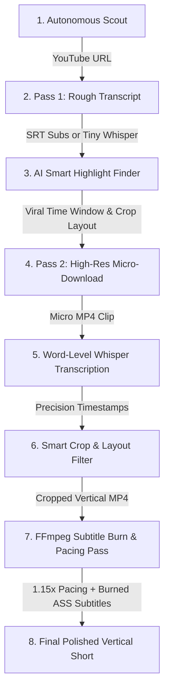

# 🎬 Shorts Clipper
### *The Ultimate Autonomous AI Video Factory*

Shorts Clipper is an industrial-grade, AI-driven automation pipeline designed to autonomously transform long-form landscape video content (such as podcasts, live streams, talk shows, and video essays) into highly-engaging, viral, 9:16 vertical clips perfect for TikTok, YouTube Shorts, and Instagram Reels.

---

## 🎯 Core Capabilities & Goal

Manually scrubbing hours of video to locate highlights, cropping coordinates, generating styled captions, and editing pacing is tedious. **Shorts Clipper** automates the entire lifecycle:

* **🤖 Autonomous Scouting Engine**: Periodically hunts for high-virality videos across drama, debate, podcast, and motivational search pools. Uses a view-velocity scoring algorithm to select target candidates while maintaining a cache of already-processed video IDs to prevent duplicates.
* **🧠 Gemini Smart Highlight Finder**: Evaluates transcripts using modern reasoning models (`gemini-2.5-flash`) via the official `google-genai` SDK to isolate the single best 30-to-60-second window containing high emotional density and a hook within the first 2 seconds.
* **🎙️ Hybrid Dual-Engine Transcription**: transparently falls back to a highly optimized local **faster-whisper** model (`tiny.en` up to `large-v3`) if external APIs are unavailable, running with optional GPU-accelerated quantization (`float16`).
* **📐 Dynamic Aspect-Ratio Layouts**: Intelligent geometry math converts widescreen footage to vertical formats. Supports `crop_center` (single subject), `crop_left`/`crop_right` (offset subjects), and `split_screen` (dual subjects for podcasts/debates).
* **⚡ Turbocharged FFmpeg Rendering**: Burns highly styled, dual-color, word-level animated Advanced SubStation Alpha (`.ass`) subtitles and applies a 1.15× pacing increase to remove dead air—in **one single FFmpeg pass** to prevent multi-encode degradation.

---

## 🏗️ System Architecture & Data Flow

The project follows a modular, domain-driven structure to maximize testability and allow components (e.g., transcription or highlight discovery) to be easily swapped.



### The 2-Pass Network and CPU Optimization
To minimize network bandwidth and API cost:
* **Pass 1 (Analysis)**: The pipeline acquires native subtitles (or downloads a low-bandwidth 5-minute audio slice) for initial transcript analysis. Gemini evaluates this text to define the high-virality window.
* **Pass 2 (Execution)**: The downloader uses yt-dlp section-clipping (`--download-sections`) to grab only the selected 30–60s clip in high resolution. Word-level transcription and vertical rendering are performed on this micro-clip, cutting processing time by up to 90%.

---

## 📁 Repository Directory Map

The directory structure separates business domains, settings, and render adapters:

```
shorts-clipper/
├── shorts_clipper/
│   ├── core/                  # Settings parser, logging configurations, exceptions
│   ├── scout/                 # Trending searches, view-velocity, and candidate selection
│   ├── downloader/            # Sectioned yt-dlp downloader & subtitle extraction
│   ├── transcription/         # Whisper and Gemini Flash audio transcription engines
│   ├── highlight_detection/   # Rule-based fallback highlight scoring
│   ├── providers/             # Gemini API client interface and response parsing contracts
│   ├── cropping/              # Aspect-ratio geometry calculators
│   ├── captions/              # ASS subtitle generation & word-level timing offsets
│   ├── rendering/             # Core FFmpeg execution adapters for cropping & burning
│   └── pipeline/              # Runner orchestrator (coordinating data flow)
├── tests/                     # Comprehensive unittest suites
├── requirements.txt           # Main production requirements
├── pyproject.toml             # Standard package metadata and optional dev extras
└── .env.example               # Template environment configuration file
```

---

## 🛠️ System Prerequisites

Your system must have the following tools installed and available in your environment path:

1. **Python 3.11+**
2. **FFmpeg**: Must be compiled with **`libass` support** to burn high-fidelity, styled subtitle tracks.
   * **Ubuntu/Debian**:
     ```bash
     sudo apt update && sudo apt install ffmpeg libass-dev -y
     ```
   * **macOS**:
     ```bash
     brew install ffmpeg
     ```
   * **Windows**: Download a full static build from [Gyan.dev](https://www.gyan.dev/ffmpeg/builds/) or install via winget:
     ```powershell
     winget install Gyan.FFmpeg
     ```
3. **yt-dlp**: Installed as a Python package, but having a system-wide executable is recommended for high-speed segment downloading.

---

## 📥 Installation & Setup

Set up your workspace inside a local Python virtual environment:

### 1. Clone & Navigate to Repository
```bash
git clone https://github.com/random-or/shorts-clipper.git
cd shorts-clipper
```

### 2. Configure Virtual Environment
```bash
# Create environment
python -m venv env

# Activate (Linux/macOS)
source env/bin/activate

# Activate (Windows Command Prompt)
env\Scripts\activate.bat

# Activate (Windows PowerShell)
.\env\Scripts\Activate.ps1
```

### 3. Install Dependencies
```bash
# Install core package
pip install -r requirements.txt
pip install -e .

# OR install with developer dependencies (for tests & lint checks)
pip install -e ".[dev]"
```

---

## 🔑 AI Credentials & Configuration

### Why is an API Key Required?
To detect emotional peaks, recognize hooks in the first 2 seconds, and define appropriate visual cropping strategies (e.g., center crop vs. split-screen layouts), the pipeline consults an LLM. By default, it uses **Google Gemini 2.5 Flash** due to its reasoning speeds and broad context.

### Configure Your Credentials
1. Copy the example configuration template:
   ```bash
   cp .env.example .env
   ```
2. Open `.env` in a text editor.
3. Obtain your API Key from [Google AI Studio](https://aistudio.google.com/).
4. Insert your credentials:
   ```env
   GEMINI_API_KEY=AIzaSyYourActualGeminiApiKeyHere
   SHORTS_PROVIDER=gemini
   ```

---

## 💻 CLI Commands & Usage

Shorts Clipper exposes three operational subcommands under the `shorts-clipper` alias or `python -m shorts_clipper` entry point.

### 1. Target Mode (Clip a Specific Video)
Fetch, analyze, crop, and burn captions for a single target YouTube video:
```bash
python -m shorts_clipper clip "https://www.youtube.com/watch?v=VIDEO_ID"
```
Override the default timestamped output destination:
```bash
python -m shorts_clipper clip "https://www.youtube.com/watch?v=VIDEO_ID" -o "./clips/my_viral_short.mp4"
```

### 2. Autopilot Mode (End-to-End Automation)
Launches the autonomous workflow: searches the trending pools, filters out non-English content, evaluates virality, downloads the video, highlights the clip, crops it, and writes a vertical video file to the output directory:
```bash
python -m shorts_clipper autopilot
```

### 3. Scout Mode (Dry Run)
Scan the trending query pools and print the URLs of the best candidate videos to the terminal without running the clipping, cropping, or rendering stages:
```bash
python -m shorts_clipper scout -n 3
```

---

## ⚙️ Advanced Settings (`.env` Variables)

Fine-tune your local pipeline parameters within your `.env` configuration file:

| Variable | Default | Description |
| :--- | :--- | :--- |
| `GEMINI_API_KEY` | *(Empty)* | API key to authorize the Gemini Highlight Detector. |
| `SHORTS_PROVIDER` | `gemini` | The target LLM engine provider (`gemini`). |
| `SHORTS_WHISPER_MODEL` | `tiny.en` | Local Whisper model size (`tiny.en`, `base.en`, `small.en`, `medium.en`, `large-v3`). |
| `SHORTS_WHISPER_DEVICE` | `cpu` | Local execution device for Whisper (`cpu` or `cuda` for NVIDIA GPU support). |
| `SHORTS_WHISPER_COMPUTE_TYPE` | `int8` | Inference quantization (`int8` for CPU, `float16` for GPUs). |
| `SHORTS_ENABLE_GPU` | `false` | Set to `true` to run both Whisper inference and FFmpeg rendering on GPU cores. |
| `SHORTS_MODELS_DIR` | `models` | Directory path where downloaded Whisper weights are stored. |
| `SHORTS_OUTPUT_DIR` | `outputs` | Target directory where all final vertical shorts are written. |
| `SHORTS_CACHE_DIR` | `.cache` | Location where seen-video database keys are stored to prevent duplicates. |
| `SHORTS_LOG_LEVEL` | `INFO` | Verbosity of terminal output logs (`DEBUG`, `INFO`, `WARNING`, `ERROR`). |

---

## 🐳 Docker Deployment

The pipeline is fully containerized. A `Dockerfile` and `docker-compose.yml` are provided in the repository root.

### Build and Run with Docker Compose
```bash
# Build the container image
docker-compose build

# Run the autopilot scouting factory inside Docker
docker-compose up
```

---

## 🔧 Verified Troubleshooting

* **Issue: `Cache load failed: [Errno 13] Permission denied`**
  * *Cause*: The script is attempting to write cache data to `/nonexistent` or a root directory.
  * *Fix*: Ensure `SHORTS_CACHE_DIR` in your `.env` points to a path within the workspace directory, for example: `SHORTS_CACHE_DIR=.cache/shorts-clipper`.

* **Issue: `ffmpeg: libass not found`**
  * *Cause*: Your system's FFmpeg binary lacks ASS library extensions required to render styled subtitles.
  * *Fix*: Re-install FFmpeg from standard system managers (e.g. `apt` on Linux or `brew` on macOS) which include `libass` by default, or download a full static bundle.

* **Issue: `yt-dlp download sections error`**
  * *Cause*: The version of yt-dlp is outdated and does not support sub-segment extraction.
  * *Fix*: Upgrade the packages:
    ```bash
    pip install --upgrade yt-dlp
    ```

---

## 🧪 Testing & Code Quality

Verify settings parsing, crop geometry calculators, ASS subtitle builders, and yt-dlp section generation logic:

```bash
# Run unit tests
python -m unittest discover -s tests -p "test_*.py"

# Check code linting
ruff check .

# Check formatting compliance
ruff format --check .
```

---

## 🛡️ License

Distributed under the **MIT License**. See [LICENSE](LICENSE) for more details.
