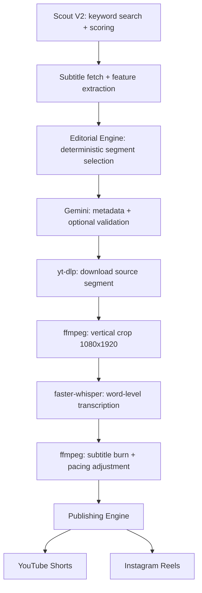

# Shorts Clipper

Automated pipeline that finds trending YouTube videos, selects engaging segments, crops them to vertical (9:16), burns word-level subtitles, and publishes to YouTube Shorts and Instagram Reels.

[](https://github.com/random-or/shorts-clipper/actions/workflows/ci.yml)


---

## What it does

Shorts Clipper takes a YouTube URL (or finds one itself) and produces a ready-to-publish vertical short. The pipeline:

1. **Discovers** trending long-form videos using keyword/niche search and a scoring algorithm (Scout V2).
2. **Selects** the best clip segment using a local deterministic Editorial Engine — no LLM in the critical path.
3. **Downloads** only the required segment via `yt-dlp`.
4. **Crops** 16:9 → 9:16 and **transcribes** with local `faster-whisper` for word-level timestamps.
5. **Burns subtitles** as styled ASS captions with configurable pacing via `ffmpeg`.
6. **Generates metadata** (title, description, tags) using Gemini — the only step that calls an LLM.
7. **Publishes** to YouTube Shorts (OAuth2) and Instagram Reels (Graph API).

The design philosophy is local-first: segment selection, transcription, and rendering all run on your hardware. Gemini is used only for metadata generation and optional semantic validation, keeping API costs near zero.

## Architecture

```
Scout V2 ──→ Editorial Engine ──→ yt-dlp Download ──→ ffmpeg Crop
                                                          │
Publishing ◄── ffmpeg Subtitle Burn ◄── faster-whisper ◄──┘
    │
    ├── YouTube Shorts (OAuth2)
    └── Instagram Reels (Graph API)
```

<details>
<summary>Mermaid diagram</summary>



</details>

## Features

| Feature | What it does | Where in code |
|---------|-------------|---------------|
| **Scout V2** | Searches YouTube by keyword/niche, scores candidates on views, recency, engagement. Self-healing: retries failed queries, rotates search terms. | `shorts_clipper/scout/` |
| **Editorial Engine** | Deterministic segment selection using 8 plugin judges (hook, silence, length, context, emotion, narrative arc, information density, Q&A). No LLM required. | `shorts_clipper/editorial/` |
| **Feature Store** | Pre-computes speech rate, pause distribution, sentence boundaries from transcript segments. Feeds all editorial plugins. | `editorial/feature_store.py` |
| **Local transcription** | `faster-whisper` runs on CPU or CUDA GPU. Word-level timestamps for precise subtitle alignment. | `shorts_clipper/transcription/` |
| **2-pass rendering** | Pass 1: vertical crop. Pass 2: subtitle burn with ASS styling and configurable pacing multiplier. Both via `ffmpeg` — no MoviePy. | `shorts_clipper/rendering/`, `shorts_clipper/captions/` |
| **Publishing Engine** | Registry-based. Ships with YouTube (OAuth2) and Instagram (Graph API via temp host staging). Add a new platform without touching the pipeline. | `shorts_clipper/publishers/` |
| **Vanguard Console** | FastAPI web UI with SSE live logs, job queue management, YouTube OAuth linking. | `shorts_clipper/api/server.py`, `shorts_clipper/ui/` |
| **Job queue** | SQLite-backed persistent queue. Decoupled worker can run independently. | `core/queue.py`, `core/worker.py` |
| **Caching** | SQLite cache for metadata, AI selections, and transcription artifacts. Saves time and API quota on re-runs. | `core/cache.py` |

## Installation

### Prerequisites

- **Python 3.11+** (pyproject.toml specifies `>=3.11`; CI tests 3.11 and 3.12)
- **ffmpeg** in your PATH (must support `libx264`)
- *(Optional)* NVIDIA GPU + CUDA for faster transcription

> [!NOTE]
> The current README previously said Python 3.10+. The actual `pyproject.toml` requires `>=3.11`.

### Setup

```bash
git clone https://github.com/random-or/shorts-clipper.git
cd shorts-clipper

python -m venv env
source env/bin/activate   # Windows: env\Scripts\activate

pip install -r requirements.txt
```

For development (adds `pytest` and `ruff`):

```bash
pip install -e ".[dev]"
```

### Install ffmpeg

- **Ubuntu/Debian:** `sudo apt install ffmpeg`
- **macOS:** `brew install ffmpeg`
- **Windows:** `winget install ffmpeg` or download from [gyan.dev](https://www.gyan.dev/ffmpeg/builds/)

## Configuration

Copy the example and fill in your values:

```bash
cp .env.example .env
```

### Environment variables

Every variable is read by `shorts_clipper/core/settings.py` via the `.env` file or OS environment. OS environment takes precedence.

#### Required

| Variable | Purpose |
|----------|---------|
| `GEMINI_API_KEY` | Metadata generation and optional semantic validation. Get from [Google AI Studio](https://aistudio.google.com/). |

#### Publishing (required for `--upload`)

| Variable | Purpose |
|----------|---------|
| `YOUTUBE_CLIENT_ID` | YouTube OAuth2 — set up via Google Cloud Console with YouTube Data API v3. |
| `YOUTUBE_CLIENT_SECRET` | YouTube OAuth2 client secret. |
| `IG_ACCESS_TOKEN` | Instagram Graph API long-lived token. |
| `IG_ACCOUNT_ID` | Instagram business account ID. |
| `PUBLIC_URL` | Base URL where your server is reachable (required for Instagram if not using temp hosts). |
| `SHORTS_USE_TEMP_HOSTS` | Set to `true` to use catbox.moe/tmpfiles.org/uguu.se instead of `PUBLIC_URL` for Instagram uploads. |

#### Optional

| Variable | Default | Purpose |
|----------|---------|---------|
| `INSTAGRAM_USERNAME` | — | Alternative Instagram auth (username/password). |
| `INSTAGRAM_PASSWORD` | — | Alternative Instagram auth. |
| `INSTAGRAM_SESSION_ID` | — | Alternative Instagram auth (session cookie). |
| `YOUTUBE_API_KEY` | — | YouTube Data API key (for Scout quota optimization). |
| `SHORTS_ENABLE_GPU` | `false` | Enable CUDA for whisper and nvenc for ffmpeg. |
| `SHORTS_WHISPER_MODEL` | `tiny.en` | Whisper model size (`tiny.en`, `base.en`, `small.en`, etc.). |
| `SHORTS_WHISPER_DEVICE` | `cpu` (`cuda` if GPU enabled) | Device for whisper inference. |
| `SHORTS_WHISPER_COMPUTE_TYPE` | `int8` (`float16` if GPU enabled) | Compute precision for whisper. |
| `SHORTS_VIDEO_CODEC` | `libx264` (`h264_nvenc` if GPU) | ffmpeg video codec. |
| `SHORTS_VIDEO_PRESET` | `ultrafast` (`fast` if GPU) | ffmpeg encoding speed/quality preset. |
| `SHORTS_SCOUT_MAX_AGE_DAYS` | `90` | Maximum age (in days) of videos the scout will consider. |
| `SHORTS_SUBTITLE_STYLE` | `default` | Subtitle styling preset. |
| `SHORTS_PROXY` | — | HTTP proxy for yt-dlp and network requests. |
| `SHORTS_PUBLISH_PLATFORMS` | `youtube,instagram` | Comma-separated list of platforms to publish to. |
| `SHORTS_PROVIDER` | `gemini` | AI provider for metadata (`gemini`, `openai`, `anthropic`, `ollama`). |
| `SHORTS_LOG_LEVEL` | `INFO` | Logging verbosity. |
| `SHORTS_OUTPUT_DIR` | `outputs` | Where final clips are written. |
| `SHORTS_CACHE_DIR` | `.cache/shorts-clipper` | Cache directory for tokens, transcripts, metadata. |
| `SHORTS_MODELS_DIR` | `models` | Directory for whisper model files. |
| `OLLAMA_BASE_URL` | `http://localhost:11434` | Ollama endpoint (if using local LLM). |
| `OPENAI_API_KEY` | — | OpenAI API key (if using OpenAI provider). |
| `ANTHROPIC_API_KEY` | — | Anthropic API key (if using Claude provider). |

> [!WARNING]
> The `.env.example` file lists `LOG_LEVEL`, `WORKER_CONCURRENCY`, and `MAX_VIDEO_LENGTH`, but the code reads `SHORTS_LOG_LEVEL` (not `LOG_LEVEL`) and does not currently read `WORKER_CONCURRENCY` or `MAX_VIDEO_LENGTH` in `settings.py`. These .env.example entries are misleading and should be updated.

## Usage

### Autopilot — full pipeline, hands-off

Scout a trending video, clip it, and optionally publish:

```bash
python -m shorts_clipper autopilot --keyword "tech podcast" --count 1 --upload
```

Options: `--keyword`, `--niche`, `--channel`, `--count`, `--upload`.

### Clip a specific video

```bash
python -m shorts_clipper clip https://www.youtube.com/watch?v=VIDEO_ID --output ./my_clip.mp4
```

### Scout only — print trending URLs

```bash
python -m shorts_clipper scout --keyword "AI news" --count 3
```

### Web dashboard (Vanguard Console)

```bash
python -m shorts_clipper web
```

Opens at `http://127.0.0.1:8000`. Use `--host 0.0.0.0 --port 9000` to customize.

> [!NOTE]
> **Broken commands in previous README:** The old README suggested `uvicorn api.server:app --reload` and `python -m shorts_clipper.cli autopilot`. Neither works — the correct module paths are `python -m shorts_clipper web` and `python -m shorts_clipper autopilot`. The worker command `python -m shorts_clipper.core.worker` does work.

### Background worker

Process jobs from the SQLite queue:

```bash
python -m shorts_clipper.core.worker
```

### Repair missing metadata

```bash
python -m shorts_clipper repair-metadata
```

### All CLI subcommands

| Command | What it does |
|---------|-------------|
| `clip <url>` | Clip a specific YouTube video |
| `autopilot` | Scout + clip + optional publish in one step |
| `scout` | Print trending URLs and exit |
| `web` | Start the Vanguard web dashboard |
| `repair-metadata` | Backfill missing metadata on existing clips |

Global flags: `--log-level {DEBUG,INFO,WARNING,ERROR}`, `--env <path>`.

## Project structure

```
shorts_clipper/
├── api/                    # FastAPI server (Vanguard Console)
├── analyze/                # Post-hoc feedback analysis
├── captions/               # ASS subtitle generation + ffmpeg burn
├── cli/                    # Auxiliary CLI commands (repair-metadata)
├── core/                   # Settings, cache, queue, worker, models, logging
├── cropping/               # Crop geometry calculations
├── downloader/             # yt-dlp integration
├── editorial/              # Deterministic segment selection
│   ├── engine.py           # Main EditorialEngine orchestrator
│   ├── feature_store.py    # Transcript feature computation
│   ├── confidence.py       # Confidence aggregation
│   ├── profiles.py         # Weighted presets for different niches
│   ├── registry.py         # Plugin registry
│   └── plugins/            # 8 scoring judges
│       ├── hook.py         # Opening hook quality
│       ├── silence.py      # Dead-air detection
│       ├── length.py       # Duration fitness
│       ├── context.py      # Topical coherence
│       ├── emotion.py      # Emotional intensity
│       ├── narrative_arc.py
│       ├── information_density.py
│       └── question_answer.py
├── highlight_detection/    # Legacy deterministic scoring (pre-Editorial Engine)
├── metadata/               # Fallback metadata generation
├── pipeline/               # Pipeline orchestrator (runner.py, finisher.py)
├── providers/              # LLM provider abstraction (Gemini, base interface)
├── publishers/             # Multi-platform publishing
│   ├── manager.py          # PublishingEngine orchestrator
│   ├── registry.py         # Publisher registry
│   ├── transports.py       # Temp file host upload (catbox, tmpfiles, uguu)
│   ├── youtube/            # YouTube OAuth2 + upload
│   └── instagram/          # Instagram Graph API
├── rendering/              # ffmpeg crop, render, pipe, thumbnail
├── scout/                  # Scout V2 trending discovery
├── transcription/          # faster-whisper integration
├── ui/                     # Static HTML/CSS/JS for Vanguard Console
└── utils/                  # Video utilities
tests/
├── benchmarks/             # Performance + determinism benchmarks
├── conftest.py
├── test_api_fixes.py
├── test_audit_fixes.py
├── test_cache_partial_hit.py
├── test_editorial_core.py
├── test_fallback.py
├── test_fallback_metadata_respects_niche.py
├── test_foundations.py
├── test_gemini_fallback.py
├── test_instagram_publisher.py
├── test_new_modules.py
├── test_publishers.py
├── test_rendering.py
├── test_scout_v2.py
└── test_sqlite_leak.py
```

~10,950 lines of Python across 78 source files. 16 test files, 73 tests.

## Test suite

Run tests:

```bash
pip install -e ".[dev]"
python -m pytest tests/ -v
```

Last verified result (2026-07-03, Python 3.12.3):

```
============================= 73 passed in 49.03s ==============================
```

Lint:

```bash
ruff check . && ruff format --check .
```

Both pass clean as of v3.2.0.

## Benchmarks

> [!IMPORTANT]
> No automated benchmark suite exists. The numbers below are from a single observed production run on consumer hardware (2-core CPU, no GPU). They are not statistically significant and should not be treated as guarantees.

| Metric | Observed value | Notes |
|--------|---------------|-------|
| End-to-end pipeline time | ~10 min | Single clip, CPU-only whisper, `tiny.en` model |
| Whisper transcription | ~86s for 90s audio | CPU, `tiny.en`, `int8` |
| ffmpeg crop + subtitle burn | ~2 min | `libx264`, `ultrafast` preset |
| YouTube upload | ~5 min | Depends on file size and connection |
| API cost per clip | < $0.001 | Gemini free tier (metadata only) |

**TODO:** Add a reproducible benchmark harness.

## Roadmap

### Completed

- [x] Package skeleton with domain-separated modules
- [x] Typed dataclass models and settings loader with `.env` support
- [x] Deterministic Editorial Engine with plugin registry (8 judges)
- [x] Scout V2 parallel trending discovery with self-healing
- [x] 2-pass ffmpeg rendering (no MoviePy)
- [x] ASS subtitle generation with word-level timing
- [x] Multi-platform publishing engine (YouTube + Instagram)
- [x] FastAPI web dashboard with SSE logs
- [x] SQLite job queue and caching layer
- [x] CI pipeline (GitHub Actions: ruff lint + pytest on 3.11/3.12)

### Planned

- [ ] Hardware encoder selection (nvenc, vaapi, videotoolbox)
- [ ] Face/person detection for dynamic smart cropping
- [ ] Subtitle style templates and platform presets
- [ ] PostgreSQL migration (for multi-user)
- [ ] Redis + Celery worker replacement (for scale)
- [ ] JWT authentication for the web API
- [ ] Docker / docker-compose packaging
- [ ] Reproducible benchmark suite

## Known documentation inconsistencies

Found during audit — these exist in the committed docs and should be cleaned up:

1. **Python version:** `pyproject.toml` says `>=3.11`. The old README said `3.10+`. The correct minimum is **3.11**.
2. **`pyproject.toml` version field:** Says `0.1.0` while the git tag and all docs say `3.2.0`. The `pyproject.toml` version was never updated.
3. **`.env.example` variables:** Lists `LOG_LEVEL`, `WORKER_CONCURRENCY`, `MAX_VIDEO_LENGTH` — none of these are read by `settings.py`. The actual env var for log level is `SHORTS_LOG_LEVEL`. The `.env.example` is also missing many variables that `settings.py` does read (GPU settings, whisper config, proxy, etc.).
4. **`docs/ROADMAP.md`:** Describes the pre-V3 flat-script architecture ("six Python modules") as if it's the current state. It references `analyzer.py`, `editor.py`, `subtitles.py`, `scout.py` — none of which exist anymore. This roadmap is a historical planning document, not current.
5. **`docs/API.md`:** Labeled "Planned API Contract" and describes REST endpoints (`POST /jobs`, `GET /jobs/{id}`) that don't match the actual `server.py` implementation. The real API has different routes.
6. **`CONTRIBUTING.md`:** Setup instructions say `python -m venv venv` (directory named `venv`) but the actual repo uses `env/`.
7. **Clone URL:** Multiple docs use `https://github.com/your-org/shorts-clipper.git` — the actual remote is `github.com:random-or/shorts-clipper.git`.
8. **Instagram auth:** `.env.example` lists `INSTAGRAM_USERNAME/PASSWORD/SESSION_ID`. The `publishing.md` doc and actual `instagram/publisher.py` use `IG_ACCESS_TOKEN` + `IG_ACCOUNT_ID` (Graph API). Both auth paths exist in code but the docs don't clearly explain which to use when.

## Troubleshooting

**ffmpeg not found or subtitle burn fails:**
Ensure `ffmpeg` is globally accessible and supports `libx264`. Test with `ffmpeg -version`.

**Instagram publishing fails with "All temporary file hosts failed":**
Set `SHORTS_USE_TEMP_HOSTS=true` in `.env`, or better, set `PUBLIC_URL` to a URL where your server is publicly reachable.

**YouTube says "channel not connected":**
You need to complete OAuth linking first. Run `python -m shorts_clipper web`, open the dashboard, and use the sidebar to connect your YouTube account.

**Whisper is slow:**
Default is `tiny.en` on CPU. For production, install CUDA and set `SHORTS_ENABLE_GPU=true`. Use a larger model like `base.en` or `small.en` for better accuracy.

**Import errors after cloning:**
Make sure you're running Python 3.11+ and installed from `requirements.txt` inside a virtual environment.

## Contributing

See [CONTRIBUTING.md](CONTRIBUTING.md). The core principle: segment selection logic must be deterministic and local. LLMs are for metadata only.

```bash
# Run tests before submitting
python -m pytest tests/ -v
ruff check . && ruff format --check .
```

## License

MIT — see [LICENSE](LICENSE).
