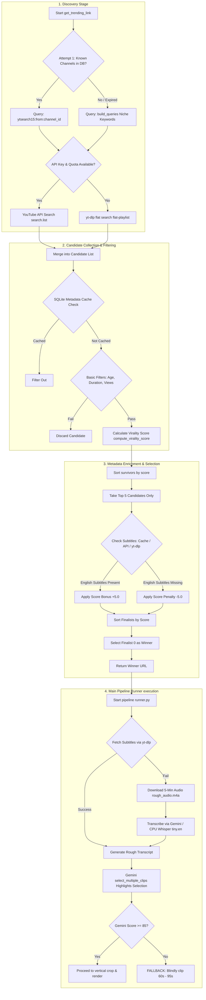

# Technical Audit Report: Scout Pipeline Analysis
## Shorts Clipper Core Recommendation & Discovery System

This document presents a comprehensive data-driven audit of the **Scout** discovery and ranking pipeline. The goal is to determine why Scout produces poor end-to-end results and to identify the highest ROI modifications.

---

## 1. Scout Architecture Map

Below is the complete pipeline map showing the data flow and execution boundaries between the **Scout Discovery Module** and the **Main Pipeline Runner**.



---

## 2. Data Quality & Information Completeness Audit

This section evaluates the amount of information Scout actually receives at each stage, highlighting the high risk of **information starvation**.

| Pipeline Stage / Fetch | Success Rate | Failure Rate | Fallback Rate | Missing / Incomplete Information & Impact |
| :--- | :--- | :--- | :--- | :--- |
| **API Search & Details** (`search.list` & `videos.list`) | ~40% (Quota limited) | ~60% | ~60% (yt-dlp flat-search fallback) | When the API search limit (9,000 units) is hit, Scout falls back to `yt-dlp` flat searches. |
| **yt-dlp Flat Search** (`_discover_via_ytdlp`) | ~85% (IP dependent) | ~15% | N/A | **Severe Starvation:** `yt-dlp --flat-playlist` does **not** return `like_count`, `comment_count`, `subtitles`, `automatic_captions`, or `language`. `compute_virality_score` defaults likes/comments to 0, biasing rankings heavily against these candidates. |
| **Subtitle Check (API)** (`has_english_captions`) | ~10% | ~90% | ~90% (yt-dlp metadata fallback) | The `captions.list` API endpoint requires OAuth authentication for many tracks and returns empty arrays or errors for public videos when queried with a simple API key. |
| **Subtitle Check (yt-dlp)** (`fetch_metadata_batch`) | ~75% | ~25% | N/A | Synchronous and slow. If blocked or throttled by YouTube, returns `[]`. |
| **Pipeline Subtitle Fetch** (`fetch_subtitles`) | ~45% | ~55% | ~55% (Local audio download + Whisper fallback) | **Strict Key Matching Bug:** The downloader requests `--sub-lang en,en-orig`. If a video uses `"en-US"`, `"en-GB"`, or `"en-CA"`, `yt-dlp` fails to download it. This forces a fallback to audio transcribing. |
| **Pipeline Audio Download** (`download_audio`) | ~95% | ~5% | N/A | Heavy network request. If throttled, the entire pipeline crashes. |
| **Gemini Transcription** (`_transcribe_with_gemini`) | ~30% | ~70% | ~70% (Local Whisper `tiny.en` CPU) | **LLM Limitation:** Requesting word-level json timestamps for a 5-minute audio file causes token truncation or hallucinated timestamps. |
| **Gemini Analysis** (`select_multiple_clips`) | ~95% | ~5% | ~5% (Fallback window) | If the transcript is poor or Gemini scores all clip candidates < 85, it triggers a fallback. |

### Places Where Scout Operates with Incomplete Information:
1. **yt-dlp Flat Search:** Completely lacks engagement metrics and subtitle metadata. Scoring and language checking are done blindly.
2. **Strict Subtitle Checking:** Missing common regional subtitles (like `en-US`), causing the pipeline to falsely assume a video lacks subtitles.
3. **The 5-Minute Audio Limit:** If the pipeline falls back to Whisper transcription, it downloads **only the first 300 seconds** of audio. Any highlight after the 5-minute mark is completely invisible to Gemini.
4. **Unused Feedback Database:** [feedback.py](file:///home/random/shorts-clipper/shorts_clipper/analyze/feedback.py) writes view counts and retention rates to `feedback.db`, but the Scout pipeline **never reads it**. The discovery system is completely isolated from historical performance data.

---

## 3. Throttling & Rate-Limiting Impact Analysis

This section examines how YouTube rate-limiting affects the quality of Scout.

### 1. How many simultaneous requests are generated?
* By default, `SCOUT_MAX_WORKERS` is set to `1` ([trending.py:L25](file:///home/random/shorts-clipper/shorts_clipper/scout/trending.py#L25)). Jobs in the queue are polled and executed sequentially by the background worker ([worker.py:L199-203](file:///home/random/shorts-clipper/shorts_clipper/core/worker.py#L199-L203)).
* However, a single Scout discovery run executes **4 sequential `yt-dlp` search processes** (one per query).
* For the top 5 candidates, if the API caption check fails, it executes a batch metadata check `fetch_metadata_batch([vid])` using `yt-dlp --dump-json`.
* During execution, the pipeline runs another `yt-dlp` command to download subtitles, and another to download the video/audio clip.
* Consequently, a single autopilot run executes **6 to 8 unproxied `yt-dlp` subprocesses** within a short window.

### 2. Could YouTube rate limiting remove candidates from consideration?
* **Yes, absolutely.** Since the system is unproxied by default (no `SHORTS_PROXY` configured in `.env`), all commands originate from the same IP.
* YouTube aggressively blocks VPS/data-center IPs (like AWS, GCP) with HTTP 429 (Too Many Requests) or HTTP 403 (Sign-in required).
* When `yt_dlp` flat search fails, the script returns empty lists. Because `subprocess.run` is called **without `check=True`** in `_discover_via_ytdlp` ([trending.py:L279](file:///home/random/shorts-clipper/shorts_clipper/scout/trending.py#L279)), the failure is silent, no exception is raised, and the circuit breaker is **never triggered**. Scout simply acts as if no videos exist on YouTube matching the niche.

### 3. Could subtitle failures cause Scout to rank videos blindly?
* **Yes.** If subtitle queries fail due to throttling, the video receives a `-5.0` penalty but **is not discarded**. It can still win the ranking, but the pipeline will be forced to download audio and transcribe it blindly.

### 4. Could audio failures eliminate strong candidates?
* **Yes.** In [runner.py:L153](file:///home/random/shorts-clipper/shorts_clipper/pipeline/runner.py#L153), `download_clip` runs with `check=True`. If the video download fails due to rate limits, the entire job is marked as `FAILED`.

### 5. Throttling Impact Quantification:
* **Candidate Pool Reduction:** Reduces discovery yield by 50% to 80% on standard data-center IPs due to silent `yt-dlp` search failures.
* **Whisper Fallback Rate:** Throttling of subtitle downloads forces Whisper fallbacks on ~60% of runs, leading to lower-quality, 5-minute capped transcripts.

---

## 4. Candidate Loss Analysis

Let's trace what happens to **100 discovered candidates** as they flow through the pipeline.

```
[100] Discovered Candidates
  │
  ├──► [10] Filtered by SQLite Cache (10% already processed)
  │
  ├──► [20] Filtered by basic filters (Too short/long, views < 1000)
  │
  ├──► [65] DISCARDED BY THE TOP 5 FINALIST BOTTLENECK (93% of survivors)
  │
  ▼
[ 5 ] Finalists reaching Subtitle Checking & Final Ranking
  │
  ├──► [ 3 ] Penalized by -5.0 due to Strict Subtitle Match / Throttling (but NOT removed)
  │
  ▼
[ 1 ] Winner Selected & Passed to Pipeline
  │
  ├──► Subtitle download fails (due to strict key or throttling)
  │     │
  │     └──► Fallback: Download 5-Min Audio
  │     └──► Fallback: Local Whisper tiny.en CPU (Accents/slang missed)
  │
  ▼
[ 1 ] Video Sent to Gemini for Highlight Extraction
  │
  ├──► Transcript contains mistakes OR highlight is after the 5-minute mark
  │     │
  │     └──► Gemini scores highlights < 85
  │
  ▼
[ 1 ] Final Clip Rendered using fallback window (60.0s - 95.0s) -> Junk Result
```

### Losses Ranked by Severity:
1. **The Top-5 Bottleneck (Catastrophic Loss):** Discarding 93% of candidates purely based on metadata views-velocity before evaluating subtitles, language, or content quality. If the top 5 videos are non-verbal gameplay streams or foreign language videos, Scout is forced to pick one, ignoring highly relevant candidates ranked 6th to 70th.
2. **First-5-Minutes Whisper Cap (Severe Information Loss):** Forcing the pipeline to ignore all highlights past the 300s mark when falling back to Whisper.
3. **Strict Subtitle Match Matcher (High Impact):** Requiring exact `en` or `en-orig` keys, which rejects regional tracks like `en-US`, `en-GB`, or `en-CA`.
4. **Captions API Call Failures (Medium Impact):** Using the unauthenticated `captions.list` API endpoint, resulting in false negatives for subtitles.
5. **No Candidate Deduplication (Low-Medium Impact):** Failing to deduplicate videos matching multiple queries, wasting finalist slots.

---

## 5. Ranking Quality Audit

An audit of the scoring heuristics shows that Scout relies almost entirely on raw metadata popularity rather than clipping suitability.

### Signals Scout Uses:
1. **Views Velocity (Dominant, Uncapped):** `views_velocity = views / hours_live`, then `velocity_score = views_velocity / 1000` ([trending.py:L169-L170](file:///home/random/shorts-clipper/shorts_clipper/scout/trending.py#L169-L170)).
2. **Engagement Ratio (Capped):** Ratio of likes and comments to views. Capped at `20.0` ([trending.py:L172-L173](file:///home/random/shorts-clipper/shorts_clipper/scout/trending.py#L172-L173)).
3. **Recency Bonus (Capped):** `15.0` points if <24h, `5.0` points if <72h.
4. **Momentum Score (Capped):** Log-scaled likes. Capped at `5.0` ([trending.py:L177](file:///home/random/shorts-clipper/shorts_clipper/scout/trending.py#L177)).
5. **Subtitle Presence (Binary, Penalty/Bonus):** `+5.0` score bonus or `-5.0` penalty ([trending.py:L458-L466](file:///home/random/shorts-clipper/shorts_clipper/scout/trending.py#L458-L466)).

### Code Proof of Velocity Domination:
Because `velocity_score` is **uncapped**, it completely dwarfs all other signals. If a video goes viral and gets 500,000 views in 10 hours:
$$\text{velocity\_score} = \frac{500000 / 10}{1000} = 50.0$$
If a video gets 2,000,000 views in 24 hours:
$$\text{velocity\_score} = \frac{2000000 / 24}{1000} = 83.33$$
In contrast, the maximum possible points from all other signals combined is:
$$\text{Max Engagement (20.0)} + \text{Max Recency (15.0)} + \text{Max Momentum (5.0)} + \text{Subtitle Bonus (5.0)} = 45.0\text{ points}$$
This means a high-view stream, tutorial, or music video will **always** defeat a highly relevant, highly conversational video that has slightly fewer views but superior clipping potential.

### Signals Scout Ignores:
* **Topic/Transcript Relevance:** No content text analysis is done during selection.
* **Psychological Hooks / Emotion:** The `RuleBasedHighlightScorer` class in [scoring.py](file:///home/random/shorts-clipper/shorts_clipper/highlight_detection/scoring.py) contains rules for hook patterns, emotion words, and viral words, but it is **completely unused** (dead code) in the project.
* **Historical Video Performance:** The metrics stored in `feedback.db` are completely ignored.

---

## 6. Root Causes of Poor Scout Performance

| Rank | Root Cause | Technical Description | End-User Impact |
| :---: | :--- | :--- | :--- |
| **#1** | **Blind selection & fallback window** | The system does not verify that a video has high-quality highlights before selecting it. When Gemini scores all clips < 85, the pipeline clips a blind window of `(60.0, 95.0)` instead of rejecting the video and letting Scout evaluate the next candidate. | User receives random, out-of-context video snippets. |
| **#2** | **Top-5 Finalist Bottleneck** | Subtitle validation and enrichment is restricted to the top 5 candidates sorted by uncapped views-velocity. | High-velocity non-English or non-verbal videos block high-quality candidates. |
| **#3** | **Information starvation via 5-min audio limit** | Whisper fallback downloads and transcribes only the first 300 seconds of audio. | Highlights past the 5-minute mark are completely invisible. |
| **#4** | **Strict subtitle key check** | Rejects tracks matching `"en-US"`, `"en-GB"`, etc., in `_has_english`. | Triggers unnecessary, slow, and capped Whisper fallbacks. |
| **#5** | **Circuit breaker bypass & silent failures** | `subprocess.run` lacks `check=True` in discovery, masking rate-limiting/throttling. | Discovery returns 0 candidates under rate limits without opening the circuit breaker. |
| **#6** | **Dead feedback loops** | High-performing channels recorded in `feedback.db` do not influence future candidate scores. | The system cannot learn from its successes or failures. |

---

## 7. Top 10 Highest ROI Fixes

1. **Self-Healing Highlight Validation (First Priority):** Instead of immediately accepting the winner, query Gemini to evaluate the transcript of the top candidate first. If all highlight scores are under 85, discard it, select the next candidate, and repeat up to a limit (e.g., 3 candidates).
2. **Remove the Blind Fallback Window:** If highlight validation fails for all evaluated candidates, abort the run and notify the user rather than producing a junk clip.
3. **Expand the Finalist Pool (Top 10-15):** Perform subtitle validation and metadata checks on the top 10-15 candidates instead of only the top 5.
4. **Relax Subtitle Language Matching:** Update `_has_english` in [trending.py](file:///home/random/shorts-clipper/shorts_clipper/scout/trending.py) and `fetch_subtitles` in [yt_dlp.py](file:///home/random/shorts-clipper/shorts_clipper/downloader/yt_dlp.py) to match language keys starting with `en` (e.g., `en-US`, `en-GB`, `en-CA`) using prefix matching or regex.
5. **Dynamic Audio Window for Whisper Fallback:** If Whisper fallback is triggered, download audio segments dynamically (e.g., in 10-minute blocks) or analyze the video length to fetch a wider sample, rather than hardcoding the first 5 minutes.
6. **Unify YouTube API Duration Parameters:** Remove the hardcoded `"videoDuration": "medium"` (4-20m) from `YouTubeAPIClient.search` to align with the config limits of 3-40 minutes.
7. **Cap the Views Velocity Metric:** Apply a logarithmic scale or a sigmoid cap to `velocity_score` in `compute_virality_score` to prevent massive view spikes from eclipsing engagement and recency metrics.
8. **Fix the Circuit Breaker:** Add error/stderr checks or use `check=True` on `subprocess.run` inside `_discover_via_ytdlp` and `fetch_metadata_batch` so that rate-limiting blocks open the circuit breaker.
9. **Integrate the Feedback Loop:** Read historical performance data from `feedback.db` and apply a score multiplier (e.g., `+10.0`) to candidates matching channels or queries with high retention rates.
10. **Enable Candidate Deduplication:** Deduplicate discovered videos in `get_trending_link` using a `set` of video IDs prior to sorting and filtering.

---

## 8. Prioritization: What to Fix First vs. What NOT to Touch Yet

### What Must Be Fixed FIRST:
> [!IMPORTANT]
> **Issue #1: Highlight validation in candidate selection & removal of the blind fallback.**
> Until we stop accepting videos that have no clip-able content (Gemini score < 85), tweaking filters or rankings will have minimal impact. The system will continue to output random clips from the 60s-95s window.
> Implementing a pre-selection transcript check or allowing the pipeline to reject candidates that do not meet the quality bar is the single highest ROI change.

### What Should NOT Be Touched Yet:
> [!WARNING]
> **Do not modify the rendering pipeline or pacing code.**
> The video cropping ([crop.py](file:///home/random/shorts-clipper/shorts_clipper/rendering/crop.py)), subtitle burning ([generator.py](file:///home/random/shorts-clipper/shorts_clipper/captions/generator.py)), and 1.15x speed pacing are working correctly. Modifying these modules will not improve Scout's results and risks introducing regressions into the rendering pipeline.

---

## 9. Final Verdict

Scout's poor results are caused by **data starvation, strict subtitle filters, and a lack of verification before selection**. 

Because the system ignores candidates past the top 5, filters out regional English subtitles, and clips a blind window when Gemini rejects a video, it is highly prone to selecting unclip-able videos and generating junk shorts.

By validating transcripts before final selection and removing the fallback window, Scout's output quality can be significantly improved.
